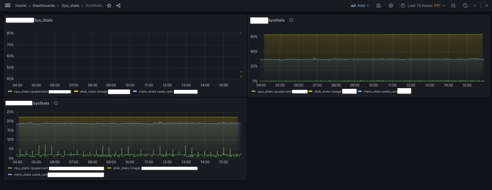

# Monitor system statistics

There are tools to monitor system statistics, however, what are their insides. 
Purpose is to read sys stats. Fullstop, no funny business.

Implementing python and influxdb with grafana for dashboards, provides simple visuals.



## Configuration 

1. Edit `creds.toml` to point the influxdb credentials file
    ```
     with InfluxDBClient.from_config_file("creds.toml","r", encoding="utf-8") as client:
    ```
2. Add
   ```
   bucket_name=""
   org=""
    ```
3. Create virtual env and `pip install influxdb_client pyinstaller`
4. `pyinstaller --onefile influxdb_liveness.py` to package the application as an executable
5. Change `ExecStart=influxdb_liveness > /dev/null &` in the .service file and `influxdb_liveliness_PID=pidof influxdb_liveness | cut -f5 -d " "` in the .sh file to reflect the current path of the packaged executable.


> **HINT** The final execution of writes to db happens in loops. Three different loops. 
    The way to execute three loops synchronously is as processes


```
from multiprocessing import Process

bucket_name=""
org=""

def loop_a():
    write_cpuStats_to_influxdb(30,bucket_name,org)

def loop_b():
    write_memStats_to_influxdb(30,bucket_name,org)
def loop_c():
    write_diskStats_to_influxdb(1200,bucket_name,org)

def main():
    Process(target=loop_a).start()
    Process(target=loop_b).start()
    Process(target=loop_c).start()

```
> **HINT** Python implementation on windows varies from on Linux thus the linux and windows folders
> 
> **HINT** The program runs as an executable packaged by pyinstaller
